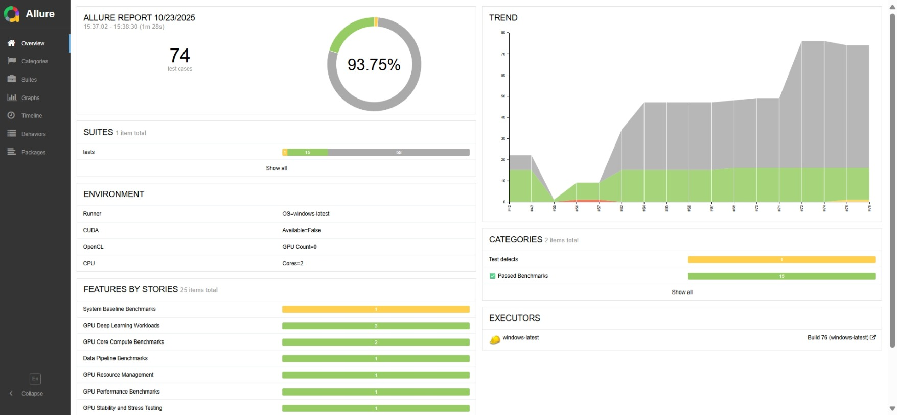

# 🤖 GPU/CPU Benchmark Suite

**A Universal Benchmarking Framework for PyTorch-2, Tensorflow-2 Performance.**

Evaluate and compare GPU and CPU performance with unparalleled accuracy using PyTorch-2.9, Tensorflow-2.20, pytest, and detailed Allure reporting. This robust framework offers 
out-of-the-box support for heterogeneous hardware, including NVIDIA, AMD, Intel, DirectML, and standard CPU-only execution. Generate clear performance metrics 
and interactive dashboards to quickly identify bottlenecks and optimize model execution across any accelerator.

---


---

## 🛠️ End-to-End DevOps & Kubernetes Workflow

This project is built on a comprehensive CI/CD pipeline and an automated Kubernetes deployment workflow:

### 1. Development & Testing (Local/CI)
* **Testing**: Developers run benchmarks locally using **Pytest** with specific markers (`-m gpu`, `-m cpu`) to validate performance and collect detailed results.
* **CI/CD (GitHub Actions / Jenkins)**: The **`ci.yml`** workflow in GitHub Actions (or an equivalent Jenkins pipeline) is triggered upon code changes.
    * It executes the **benchmark tests** against various hardware configurations.
    * It uses **Docker** to ensure a consistent, reproducible environment for testing.
    * It generates **Allure Reports** and plots system metrics (`scripts/plot_gpu_metrics.py`).

### 2. Packaging & Publishing
* **Docker Image Creation**: Using one of the provided `Dockerfile` variants (`Dockerfile.mini`, `Dockerfile.report`), a Docker image containing the test environment, report server, and dependencies is built.
* **Registry Push**: The final image is tagged and pushed to **Docker Hub** (or a private registry).

### 3. Automated Kubernetes Deployment
The **`deploy_gpu_workflow.py`** script manages the final deployment to a Kubernetes cluster:
* **Cluster Cleanup**: It first runs `kubectl delete deployment --all` for a clean state.
* **Dynamic GPU Detection**: It scans cluster nodes for available extended GPU resources (e.g., `gpu.intel.com/i915`, `nvidia.com/gpu`).
* **Resource Allocation**: The deployment manifest is dynamically configured to request the detected **GPU resource** or fall back to standard **CPU limits (1 core / 1Gi)**.
* **Deployment & Access**: It creates the optimized Kubernetes Deployment and Service. Once the Pod is running, it initiates a blocking **`kubectl port-forward`** to map the cluster service (Port 80) to your local machine (Port 8080), allowing instant, interactive access to the Allure Report dashboard via `http://127.0.0.1:8080`.

---

## 💡 Project Overview  
This framework implements **GPU/CPU performance benchmarking** using `PyTorch`, `TensorFlow`, `Pytest`, `Pytest-benchmark`, and leveraging advanced CI/CD with Kubernetes & Docker.
It automatically detects available accelerators, measures inference throughput, GPU/CPU utilization, I/O, memory usage, etc., and produces **interactive Allure reports** for analysis.


| **Component** | **Technology** | **Role** |
|---------------|----------------|----------|
| Test Runner | **pytest** | Executes benchmark and stress tests. |
| Performance Metrics | **pytest-benchmark / SystemMetrics** | Measures FPS, CPU/GPU utilization, memory usage. |
| GPU Detection | **gpu_check.py** | Detects NVIDIA CUDA, AMD ROCm, Intel GPU, DirectML, or CPU fallback. |
| Reporting | **Allure** | Generates professional, interactive HTML dashboards with charts. |

---

## 🚀 Getting Started  

### 🔧 Prerequisites  
- 🐍 Python 3.10+ (recommended)  
- 📈 Optional: Allure command-line tool for report viewing  
- 💻 Windows or Linux system with GPU support (optional for CPU-only fallback)  

### ⚙️ Installation  

Clone the repository:  
```bash
git clone https://github.com/luckyjoy/gpu_benchmark.git
cd gpu_benchmark
```

Run the setup script to create a virtual environment, install dependencies, and detect GPU on localhost.  
```bash

Usage:   python gpu_benchmark.py <Build_Number> [suite]
Example: python gpu_benchmark.py 4 gpu 
-> Run GPU Benchmark with GPU suite, build number 4, on localhost, and generate ALlure report. (No CI/CD, Kubernetes, Docker)

Usage:   python run_kubernestes.py <Build_Number> [Suite_marker or tests] [Dockerfile]
Example: python run_kubernestes.py 1 tests/test_data_preprocessing.py Dockerfile.custom
Example: python run_kubernestes.py 1 -m gpu Dockerfile.custom
Defaults: Dockerfile=Dockerfile.mini, Test=tests/test_data_preprocessing.py
-> Builds Docker images, runs GPU Benchmark [Suite_marker or tests] with build number 1, 
-> Generates Allure report, and pushes Docker images to Docker Hub.

Usage:   python deploy_gpu_workflow.py <Build_Number>
Example: python deploy_gpu_workflow.py 1
-> Creates the necessary Pod deployment and service, monitors Pod creation & reports scheduling events.
-> Deploys Docker image (build tag number 1) from Docker Hub, assigns a worker to run the Docker image within the assigned Pod.
-> Generates Allure Report.

```

The script will:  
- Create `venv310` if missing  
- Detect available GPU or fall back to CPU  
- Install all required packages in requirements.txt
- Run benchmark tests and store results in `allure-results/`  

---

## 🐳 Dockerized Execution (Optional)

Ensure consistent results across systems by running inside Docker.

### 🧱 Docker Image  
Image: **`gpu-benchmark:latest`** — includes:  
- Python 3.10 or 3.11 environment  
- Required preinstalled packages
- Allure CLI for reporting  
- `/app` as working directory  

### ▶️ Run Tests via Script  

**Script:** `run_docker.bat` (Windows)  
**Workflow:**  

| **Step** | **Description** |
|-----------|-----------------|
| 1️⃣ Check Docker | Verifies Docker Desktop is running. |
| 2️⃣ Clean Up | Deletes previous `allure-results` and `.benchmarks`. |
| 3️⃣ Build / Pull | Builds or updates Docker image. |
| 4️⃣ Execute Tests | Runs GPU/CPU benchmark suite. |
| 5️⃣ Generate Report | Produces Allure HTML output. |
| 6️⃣ Serve Report | Opens Allure dashboard locally. |

Command to execute:  
```bash
run_docker.bat
```

---

## 🌳 Framework Architecture  

```
gpu_benchmark/
├─ Dockerfile                          # Main Docker build file
├─ Dockerfile.mini                     # Minimal Docker build file
├─ Dockerfile.report                   # Docker build file for the report server
├─ Jenkinsfile						   # Option for Jenkins CI pipelines
├─ README.md
├─ requirements.txt
├─ pytest.ini                          # Pytest configuration
├─ g.bat                               # Convenience batch file
├─ gpu_benchmark.py                    # Main setup & execution script
├─ deploy_gpu_workflow.py              # Kubernetes GPU auto-detection and deployment script
├─ run_docker.py                       # Script to run tests inside Docker
├─ run_gpu_benchmark.bat               # Windows batch script to run benchmarks
├─ run_kubernestes.py                  # Kubernetes execution wrapper
├─ gpu-workflow.yaml                   # Kubernetes manifest for deployment
├─ gpu-benchmark-cpu-deployment.yaml   # Kubernetes manifest for CPU-only deployment
├─ __init__.py
├─ allure-report/                      # Static Allure HTML output directory
├─ allure-results/                     # Pytest-Allure raw results directory
├─ images/                             # Documentation image assets
│  ├─ allure_report.jpg
│  └─ gpu_cpu_utilization.png
├─ scripts/                            # Utility scripts for metrics, plotting, and trend analysis
│  ├─ __init__.py
│  ├─ gpu_utils.py
│  ├─ plot_gpu_metrics.py               # Generate charts for Allure
│  ├─ system_metrics.py                 # Capture CPU/GPU system metrics
│  └─ update_trend.py
├─ supports/                           # GPU detection and telemetry logic
│  ├─ __init__.py
│  ├─ categories.json
│  ├─ environments.properties
│  ├─ executor.json
│  ├─ gpu_check.py                      # Detects available hardware devices
│  ├─ gpu_monitor.py                    # Real-time GPU monitoring
│  ├─ performance_trend.py
│  ├─ telemetry_collector.py            # Gathers performance data
│  ├─ telemetry_hook.py
│  ├─ telemetry_trend.py
│  ├─ telemetry_visualizer.py
│  ├─ ubuntu.properties
│  └─ windows.properties
├─ tests/                              # Benchmark test cases
│  ├─ __init__.py
│  ├─ conftest.py                       # Pytest fixtures and hooks
│  ├─ device_utils.py                   # Utilities for device handling
│  ├─ test_amd_gpu_accelerator.py
│  ├─ test_cpu_reference.py             # CPU-only benchmarks
│  ├─ test_data_preprocessing.py
│  ├─ test_directml_gpu_accelerator.py
│  ├─ test_gpu_compute.py
│  ├─ test_gpu_convnet.py
│  ├─ test_gpu_matrix_mul.py
│  ├─ test_gpu_memory.py
│  ├─ test_gpu_mixed_precision.py
│  ├─ test_gpu_model_inference.py
│  ├─ test_gpu_stress.py
│  ├─ test_gpu_tensorflow_benchmark.py
│  ├─ test_gpu_transformer.py
│  ├─ test_idle_baseline.py
│  ├─ test_inference_load.py
│  ├─ test_intel_gpu_accelerator.py
│  ├─ test_io_accelerator.py
│  ├─ test_multi_gpu.py
│  ├─ test_network_io_accelerator.py
│  ├─ test_nvidia_gpu_accelerator.py
│  ├─ test_nvidia_real_gpu.py
│  ├─ test_nvidia_tensorrt_cudnn.py
│  └─ test_parallel_training.py
├─ .github/                            # GitHub Actions CI/CD workflows
├─ venv310/                            # Virtual environment (auto-created)
└─ .benchmarks/                        # Pytest-benchmark history
```

---

## 🏷️ Test Tags & Execution   

The framework uses **Pytest Markers (`-m`)** to categorize and select specific test suites for execution.

| **Tag** | **Focus Area** | **Description** |
|:--------|:----------------|:----------------|
| `gpu` | Core Benchmark | Tests running on any available accelerator (CUDA / ROCm / DirectML / Intel GPU). |
| `cpu` | Fallback / Reference | Tests running on CPU fallback. |
| `nvidia` | NVIDIA-Specific | Tests targeting NVIDIA CUDA features (e.g., CUDA, Tensor Cores). |
| `amd` | AMD-Specific | Tests targeting AMD ROCm features. |
| `intel` | Intel-Specific | Tests targeting Intel oneAPI / i915 features. |
| `directml` | DirectML-Specific | Tests targeting DirectML features (Windows / WSL). |
| `benchmark` | Performance Metric | Measures FPS, utilization, memory, and throughput. |
| `stress` | Endurance / Load | Heavy-load GPU endurance tests. |

---

### 🧪 Local Command Line Execution  

Use the commands below to execute specific test suites and generate Allure data locally.

| **Execution Mode** | **Command** |
|:--------------------|:------------|
| Run All GPU Benchmarks | `pytest -m gpu --alluredir=allure-results -v` |
| Run All CPU Benchmarks | `pytest -m cpu --alluredir=allure-results -v` |
| Run Specific Tag (e.g., Performance + GPU) | `pytest -m "benchmark and gpu" --alluredir=allure-results` |
| Run GPU/CPU Combined | `pytest -m "benchmark or gpu or cpu"` |

---

## 📊 Professional Test Reporting  

### 1️⃣**Interactive Allure Report (Recommended)**  
```bash
python -m venv venv310
Linux/macOS (Bash/Zsh):	source venv310/bin/activate
Windows (Command Prompt): call venv310\Scripts\activate
pytest --alluredir=allure-results
pytest /tests/test_gpu_tensorflow_benchmark --alluredir=allure-results
pytest -m "gpu or cpu" --alluredir=allure-results
pytest -m gpu --alluredir=allure-results
allure serve allure-results

```
📸 *Allure Report Preview:* 





> Opens an interactive HTML dashboard with detailed execution insights.

### 2️⃣ **Static HTML Report (Optional)**  
```bash
pytest --html=reports/report.html --self-contained-html
```

---

## ⚙️ CI/CD Integration

| System | Description |
|--------|-------------|
| Jenkins / GitHub Actions | Automates test execution and report generation |
| Docker | Guarantees repeatable benchmark environments |
| Allure | Produces professional dashboards for CI/CD pipelines |

---

## 🤝 Contributing Guidelines

1. Fork the repository  
2. Create a feature branch  
3. Implement new tests, benchmarks, or reporting features  
4. Run `pytest -v` locally and verify results  
5. Submit a Pull Request with a clear description  

**Code Style:**  
- Follow **PEP8** conventions  
- Use **pytest markers** consistently  
- Ensure **Allure reports** generate without errors  
- Document new metrics or tests in **Allure charts**  

---

## 🪪 License

Released under the **MIT License** — free to use, modify, and distribute.

---

📬 *Contact:* Bang Thien Nguyen [ontario1998@gmail.com](mailto:ontario1998@gmail.com)  

---

> _“Measure performance before you optimize — know your hardware before you test your code.”_
